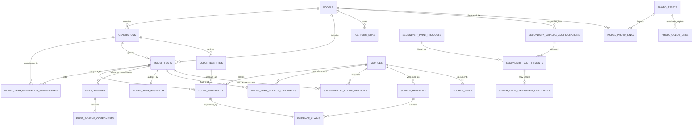

# Normalized Parquet database

This directory is the canonical analytical export of the archive. It separates
vehicle identity, model-year presence, platform eras, color identity,
year-specific color availability, multi-color paint schemes, source documents,
evidence links, and photo provenance. `manifest.json` records every table's row count, primary key,
foreign keys, and SHA-256.

The current export uses schema version 11. In this version,
`color_availability.application_type` is required and records how each color
was offered or applied, separately from whether the source says it was
available. RPO, SEO, literal SEO-cell state, normalized and literal WA values,
authorized-upfitter order codes, minimum-batch, and factory-installation claims
are structured fields rather than prose-only annotations.

Rows and dictionary inputs are deterministically sorted, and volatile build
timestamps are kept out of Parquet metadata. Identical tracked inputs therefore
produce byte-identical Parquet files; a two-pass build check covers this rule.

## Tables

| Table | Grain | Current rows |
|---|---|---:|
| `models.parquet` | One Chevrolet U.S. nameplate | 149 |
| `generations.parquet` | One contiguous display, platform band, or exact program timeline per model | 968 |
| `model_years.parquet` | One catalogued model and model-year pair | 1,792 |
| `model_year_generation_memberships.parquet` | One generation, specialty overlay, or exact program partition attached to a model-year | 2,305 |
| `platform_eras.parquet` | One sourced base, platform, or era band | 218 |
| `color_identities.parquet` | One normalized color timeline identity within a model generation | 1,686 |
| `color_availability.parquet` | One source-backed model, year, and color listing | 2,000 |
| `paint_schemes.parquet` | One exact model-year two-tone or decor-package combination | 1,369 |
| `paint_scheme_components.parquet` | One primary or secondary component of a paint scheme | 2,738 |
| `model_year_research.parquet` | One audit and source-availability status per model-year | 1,792 |
| `model_year_source_candidates.parquet` | One official GM retrieval lead linked to a model-year | 1,862 |
| `secondary_catalog_configurations.parquet` | One audited RockAuto `cc` configuration | 20 |
| `secondary_paint_products.parquet` | One audited RockAuto `pk` touch-up product | 28 |
| `secondary_paint_fitments.parquet` | One product listed for one audited RockAuto configuration | 111 |
| `color_code_crosswalk_candidates.parquet` | One unverified retailer code and model-year research lead | 96 |
| `supplemental_color_mentions.parquet` | One exact research-only color mention from an incomplete model-year source | 0 |
| `sources.parquet` | One canonical source URL | 2,718 |
| `source_revisions.parquet` | One immutable file revision of a source | 1,856 |
| `evidence_claims.parquet` | One exact source-revision and locator claim for a published availability row | 2,000 |
| `source_links.parquet` | One source-to-claim citation | 27,631 |
| `photo_assets.parquet` | One archived Wikimedia Commons original | 302 |
| `model_photo_links.parquet` | One model or exact-year photo association | 304 |
| `photo_color_links.parquet` | One tentative photo-to-color association | 5 |

Counts in this README describe the 2026-07-22 build. `manifest.json` controls
if later research changes them.

## Evidence guarantees

- Every row in `color_availability.parquet` has an
  `evidence_source_id`, chart title, exact source locator, and source revision.
- `evidence_source_id` joins to `sources.parquet`, which supplies the direct
  canonical URL and, where archived, the immutable SHA-256 and byte length.
- The same claim has a row in `source_links.parquet` with
  `claim_type = color_availability_evidence`.
- Every published availability also has one row in `evidence_claims.parquet`
  tied to an immutable `source_revisions.parquet` SHA-256 and either a parsed
  list of exact PDF pages or a retained image-region locator. This is the
  versioned evidence layer; the URL is only the logical source identity.
- Schema version 11 retains nullable `factory_code` and
  `transcribed_factory_code` fields. The companion status is required and
  limited to `explicit_none_in_source`, `printed_in_source`,
  `not_printed_in_source`, or `not_stated_in_source`. Source-printed WA
  touch-up references remain in the separate `touch_up_code` and
  `transcribed_touch_up_code` fields.
  Placeholder prose is never stored in a code column, and the evidence claim
  repeats both the nullable value and its status so the reason for a missing
  code remains source-linked.
- Schema version 11 stores `rpo_code`, `seo_code`, `seo_code_status`,
  `source_seo_code_raw`, `source_seo_code_cell_state`, `minimum_batch_units`,
  and nullable `factory_installation_claim` on each applicable availability
  row. The paired `transcribed_*` SEO and RPO fields in
  `evidence_claims.parquet` preserve what the cited table prints. A blank SEO
  cell, a literal `TBD` cell, and a printed code remain distinct; no value is
  inferred into a blank cell. Batch minimums and assembly-plant claims are
  recorded only when the source supports them. The controlled SEO-cell states
  include printed codes, blanks, literal `TBD`, literal `NONE`, an em dash, and
  a source table with no SEO column.
- Schema version 11 adds `wa_code`, `source_wa_code_raw`, and
  `source_wa_code_cell_state`, plus `upfitter_code_1`, `upfitter_code_2`,
  `upfitter_solid_color_option`, and `upfitter_two_tone_color_option`.
  Normalized WA values remain distinct from whether the table printed `WA-`.
  Kerr order codes and AAS/AAT options are not mislabeled as GM SEO codes.
  `evidence_claims.parquet` repeats the corresponding `transcribed_*` values.
- Schema version 11 also requires `color_availability.application_type` for
  every row. `availability_state` records whether and when the source says the
  color was offered. `application_type` separately records the source-backed
  offering or application mechanism. This prevents an authorized post-build
  upfitter finish from being mislabeled as factory-applied paint.
- Schema version 11 retains nullable `program_id` and `program_label` columns in
  `generations.parquet`. They preserve exact simultaneous program identities,
  including separate Caprice 9C1 PPV and 9C3 Detective timelines, without
  breaking the shared sourced platform or era band.
- Schema version 11 retains
  `model_year_research.other_availability_state_count`. For every model-year,
  `listed_count + restricted_count + other_availability_state_count` equals
  `exact_listing_count`. The new aggregate counts listings whose exact state is
  neither `listed` nor `restricted`; the source-specific value remains in
  `color_availability.availability_state` and is not flattened in the research
  table.
- `paint_schemes.parquet` contains 184 exact 1995-1999 Tahoe ZY2 rows and 1,185
  exact 1977-1981 and 1983-1999 Suburban two-tone or decor-package rows. Package, body
  style, stripe, interior, placement, restriction, exact page, and source
  revision remain on the scheme row.
- `paint_scheme_components.parquet` retains exactly two ordered components per
  scheme, with `component_role = primary` or `secondary` and
  `standalone_availability_asserted = false`. A component row never creates a
  `color_availability.parquet` row.
- A missing color row means only that the year remains unverified. It is never
  a negative availability claim.
- `model_year_research.parquet` distinguishes 85 complete `color_chart_verified`
  model-years, six `reviewed_qualified_historical_table` years, 56 qualified
  palette-union years, 42 years whose strongest status is
  `reviewed_specialty_palette_subset`, four reviewed no-chart years, and 1,599
  `color_chart_unverified` years.
- Rows with `claim_status = published_qualified_palette_union` preserve the
  official Fleet Guide color union but do not claim paint codes, trim-level
  restrictions, or completeness under the Online Order Guide. This build has
  454 qualified-palette rows across 56 model-years.
- Rows with `claim_status = published_specialty_palette_subset` preserve 569
  exact, visually reviewed specialty or public-safety listings across 57
  application model-years. In 42 of those model-years, the specialty subset is
  the strongest research status. The other 15 coexist with a separately complete or
  qualified regular palette. A specialty subset never makes the regular
  palette complete.
- Four rows with `claim_status = published_qualified_historical_table` preserve
  ordinary 1981 exterior-color-table evidence for Sportvan, Chevy Van,
  Cutaway/Hi-Cube Van, and Step-Van/Step-Van King. They are not specialty rows,
  do not assert factory installation, and do not infer continuity with SEO 9V5.
- The earlier supplemental-only 2002-2004 Suburban change statements have been
  superseded by complete exact-year evidence. Those years now contribute 24
  source-backed availability rows, while the change statements remain linked
  as supporting provenance. `supplemental_color_mentions.parquet` is therefore
  empty in this build.
- `model_year_generation_memberships.parquet` makes every generation assignment
  explicit. Each model-year has exactly one primary membership. There are 509
  `specialty_overlay` memberships and one `qualified_historical_overlay`
  membership, while three `program_partition` memberships preserve the other simultaneous 2000 Tahoe
  programs beside the primary base/LS program.
  Availability may reference only a registered membership.
- Forest Service Green remains an unresolved record in the specialty source
  ledger's `search_leads`. It has no `color_availability` row, model-year route,
  or asserted equivalence to Woodland Green.
- `photo_color_links.parquet` keeps `factory_paint_match_status = unverified`
  until the depicted paint has separate documentary review. Photos do not
  establish factory availability.
- Source-discovery rows for unscreened GM kits say so explicitly. Inclusion in
  the official index does not prove that the PDF contains a paint chart.
- The four RockAuto tables preserve secondary retailer observations only: 20
  configurations, 28 products, 111 fitments, and 96 unverified crosswalk
  candidates. They never create `color_availability` or `evidence_claims` rows.
  The public UI exposes the candidates only as disabled, clearly labeled
  all-fields regex research leads with no model-year route.

### `application_type` values

`application_type` is non-null for all 2,000 availability rows. It describes
the mechanism evidenced by the source, not the color’s availability state or
whether the surrounding model-year palette is complete.

| Value | All availability rows | Semantics |
|---|---:|---|
| `manufacturer_listed` | 1,427 | Ordinary manufacturer-listed color availability, including regular charts and qualified palette unions. All rows of this type are outside the specialty subset. |
| `authorized_upfitter_post_build` | 180 | The vehicle was built in a required base finish, then painted by an authorized upfitter. This is not a factory-applied finish claim. |
| `factory_installed_special_equipment_option` | 4 | The primary source expressly says the SEO paint was installed at the assembly plant. |
| `manufacturer_special_equipment_option` | 32 | A manufacturer SEO paint listing with exact eligible model scope, without a separate assertion that the paint was applied at the assembly plant. |
| `special_equipment_option_paint` | 230 | An SEO paint row for an exact police or special-service program. Read `availability_state` for open, planned, unavailable, or closed timing. |
| `specialty_program_unspecified` | 41 | A legacy reviewed specialty row whose source proves the restriction but does not support a narrower application-mechanism classification. It does not imply factory application. |
| `standard_program_palette` | 86 | A standard, non-SEO color listed for an exact PPV or SSV program palette, or an ordinary qualified-historical chart row. This consists of 82 specialty-program rows and four qualified-historical rows. |
| **All availability rows** | **2,000** | Every source-backed color availability row in the current export. |

Of the 2,000 rows, 569 have
`claim_status = published_specialty_palette_subset`; the four ordinary
qualified-historical rows remain outside that specialty total.

## Relationship map



## Query examples

Find every verified Chevrolet Tahoe color and its exact source link:

```sql
SELECT a.model_year, a.source_color_name, a.factory_code, a.touch_up_code,
       a.factory_code_status, a.application_type,
       a.availability_state, a.restriction, a.evidence_locator,
       s.canonical_url
FROM read_parquet('data/parquet/color_availability.parquet') a
JOIN read_parquet('data/parquet/sources.parquet') s
  ON s.source_id = a.evidence_source_id
WHERE a.model_id = 'tahoe'
ORDER BY a.model_year, a.source_color_name;
```

Find every unverified model-year without treating the gap as unavailability:

```sql
SELECT m.name, y.model_year, g.label, y.research_status
FROM read_parquet('data/parquet/model_years.parquet') y
JOIN read_parquet('data/parquet/models.parquet') m USING (model_id)
JOIN read_parquet('data/parquet/generations.parquet') g USING (generation_id)
WHERE y.research_status = 'color_chart_unverified'
ORDER BY m.name, y.model_year;
```

Find every source-backed two-tone scheme without flattening its components:

```sql
SELECT p.model_year, p.package_code, p.package_name, p.body_style_scope,
       primary_color.source_color_name AS primary_color,
       primary_color.factory_code AS primary_code,
       secondary_color.source_color_name AS secondary_color,
       secondary_color.factory_code AS secondary_code,
       p.stripe_colors, p.interior_colors, p.evidence_locator,
       s.canonical_url
FROM read_parquet('data/parquet/paint_schemes.parquet') p
JOIN read_parquet('data/parquet/paint_scheme_components.parquet') primary_color
  ON primary_color.paint_scheme_id = p.paint_scheme_id
 AND primary_color.component_role = 'primary'
JOIN read_parquet('data/parquet/paint_scheme_components.parquet') secondary_color
  ON secondary_color.paint_scheme_id = p.paint_scheme_id
 AND secondary_color.component_role = 'secondary'
JOIN read_parquet('data/parquet/sources.parquet') s
  ON s.source_id = p.evidence_source_id
ORDER BY p.model_id, p.model_year, p.paint_scheme_id;
```

Rank unscreened official GM source leads for those gaps:

```sql
SELECT m.name, c.model_year, c.relation, c.candidate_status,
       c.source_title, s.canonical_url
FROM read_parquet('data/parquet/model_year_source_candidates.parquet') c
JOIN read_parquet('data/parquet/models.parquet') m USING (model_id)
JOIN read_parquet('data/parquet/sources.parquet') s USING (source_id)
WHERE c.candidate_status <> 'governing_source_reviewed'
ORDER BY c.candidate_rank, m.name, c.model_year;
```

Search all source-backed color fields with a regular expression in DuckDB:

```sql
SELECT a.*, s.canonical_url
FROM read_parquet('data/parquet/color_availability.parquet') a
JOIN read_parquet('data/parquet/sources.parquet') s
  ON s.source_id = a.evidence_source_id
WHERE regexp_matches(
  concat_ws(' ', a.model_id, a.model_year::VARCHAR, a.source_color_name,
            coalesce(a.factory_code, ''), a.factory_code_status,
            a.application_type,
            coalesce(a.restriction, ''), a.evidence_chart),
  '(?i)forest.*green'
);
```

## Rebuild and validate

```powershell
python scripts/build-normalized-parquet.py
python scripts/validate-normalized-parquet.py
```

Pass `--crawler-db tmp/crawler-state/queue.sqlite3` while a local crawl exists
to enrich official PDF source rows with downloaded byte hashes and lengths.
The tracked artifact manifest becomes the reproducible source after the crawl
is complete.
